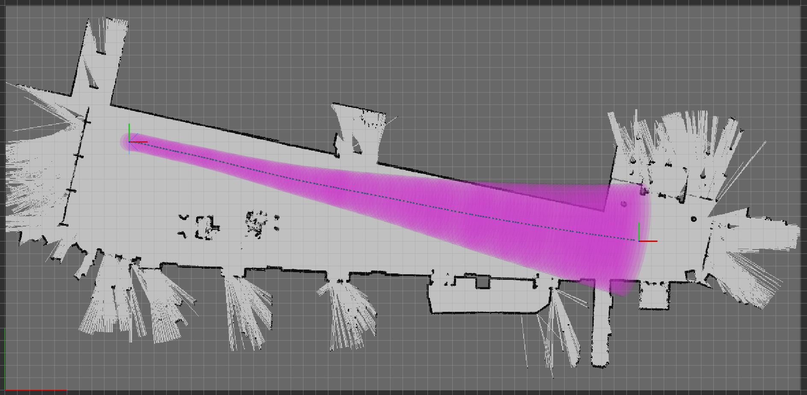
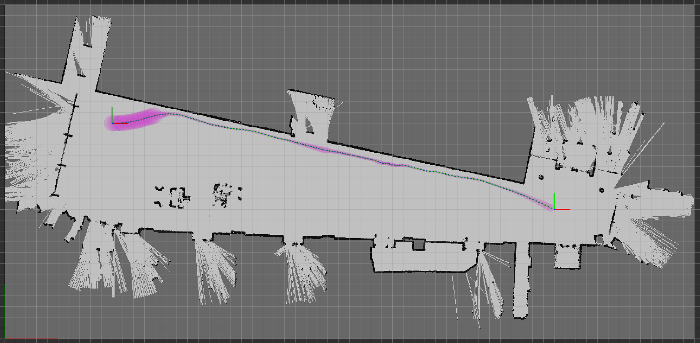
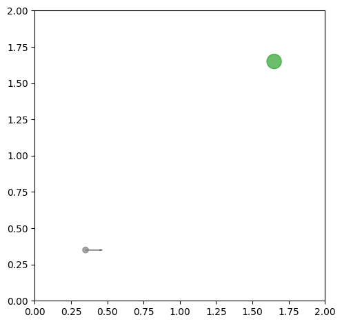
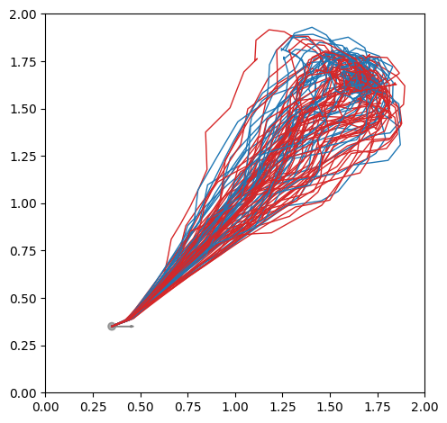
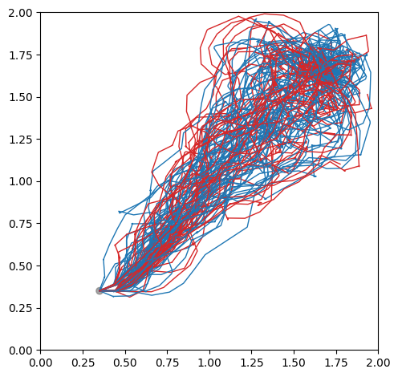
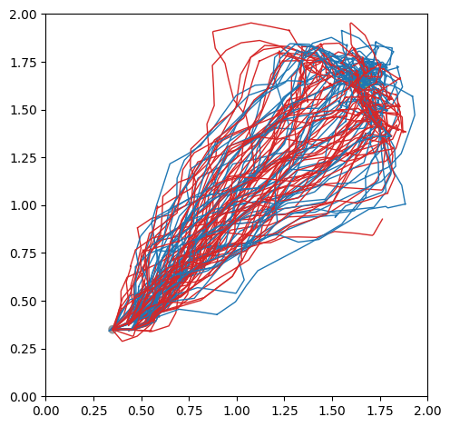
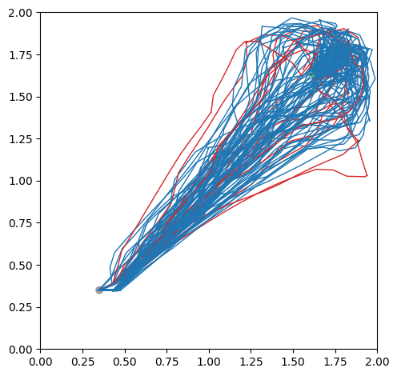

This is my research project, which considers the problem of motion planning that handles system uncertainty.
The "official" name of the problem is stochastic control.
But, I think it paints a better picture to call it **Stochastic Motion Planning** to remind us we are planning trajectories for vehicles instead of, for example, balancing a inverted pendulum.
(Although in theory, the two problems are not so different despite the dissimilarity in the systems.)

The research is motivated by the wide adoption of (half of) the **separation theorem** in practical applications.
The separation theorem allows control algorithms to assume the availability of perfect state knowledge.
It is true for linear systems with quadratic costs, beyond which, the theorem is hard to justify.
Unfortunately, almost all robotic systems that we are interested in are nonlinear, while few state estimation algorithm is able to estimate the state perfectly.
Failing to meet the assumption can jeopardize the reliability and safety of the system.

My goal in this research project is to address the stochastic motion planning problem in a principled way by
(1) modeling it as a Partially Observable Markov Decision Process (POMDP), and
(2) develop algorithms therefor.

## **Belief Space Planning using iLQG**

In this work, we extend iterative Linear-Quadratic-Gaussian (iLQG) to solve the stochastic motion planning problem.
The specific task under consideration is to navigate a car-like robot with Lidar from point A to B in a known environment.

This work addresses two limitations of [iLQG introduced by van den Burg](https://journals.sagepub.com/doi/abs/10.1177/0278364912456319) that prevent its application to navigate common autonomous vehicles:

* **Cannot work with nondifferentiable motion and measurement models.**

  Measurement models for Lidars are often nondifferentiable because of the discontinuity in the environment.

* **Degenerate with sparse informative measurements.**

  Informative measurements from commonly used sensors, such as Lidars and cameras, are sparse because of the limited sensing range.

Below highlights belief trajectories planned by our work and some other methods that can be also applied in practice to navigate a car-like robot with Lidar.

|       |       |       |
| :---: | :---: | :---: |
||||
| iLQR                     | ML-iLQG                   | Modified-iLQG (our work)   |

* **iLQR**: The trajectory is optimized with iLQR which only considers motion uncertainty while assumes perfect state infomration.

* **M-iLQG**: The trajectory is optimized with iLQG assuming maximum likelihood future measurements.

As the figure shows, the modified iLQG (our work) is able to actively drive the robot along the wall for more accurate localization.

Related publication: [[under review]]()

## **POMCP++: A General POMDP Solver**

Using iLQG to solve POMDPs is efficient in finding a local optimum.
Especially, once the solution is found offline, the time to generate control inputs online is negligible.

However, iLQG comes with intrinsic limitations.
First, iLQG requires explicit formulations of the system models, which can be sometimes out of reach (like only generative models are available).
Second, iLQG requires the objective function to be second-order differentiable.
It could be unintuitive to define costs satisfying this property.
Further, it is often hard to babysit the parameters of various cost terms to achieve a desired trajectory (maybe this is a common headache for almost all LQR solutions).

General POMDP solvers, like [[Pineau, IJCAI2013]](http://www.cs.cmu.edu/~ggordon/jpineau-ggordon-thrun.ijcai03.pdf), pose minimal assumptions on the system and task modeling, which address the aforementioned limitations of iLQG.
However, general POMDP solvers are often good for discrete systems (systems with finite discrete state, control and measurement spaces).
Few success has been reported in applying general POMDP solvers to continuous robotic systems, such as navigating a car-like robot with Lidar.

In this work, we propose POMCP++ built upon [POMCP by Silver](https://papers.nips.cc/paper/2010/hash/edfbe1afcf9246bb0d40eb4d8027d90f-Abstract.html), which can be applied to continuous robotic systems. More specifically, we address the following limitations of POMCP:

* **Degenerate with continous measurement space.**

  With continous measurement space, POMCP degenerate to a shallow tree of depth one.

* **Over-optimistic in estimating values for state-dependent rollout policies.**

  This limitation does not exist for state-independent rollout policies, like a random rollout policy.
  However, it is often desired to use a more "intelligent" rollout policy by leveraging domain knowledge.
  As in the case of motion planning, we may use deterministic motion planning methods, such as A\*, to generate rollout policies.
  Such rollout policies are state-dependent.

Below shows the comparison between POMCP++ and some other methods in a simulation.
The task is to navigate a car-like robot with Lidar from bottom left (gray dot) of the map to top right (green dot).
Since there is no obstacle in the map, we may expect the robot to actively approach the edges or corners to reduce its localization uncertainty. The blue and red paths are success and failure cases over 100 simulations.

|        |        |        |
| :----: | :----: | :----: |
||||
| configuration | RHC     | DESPOT             |
|                       |||
|               | POMCPOW | POMCP++ (our work) |

* **RHC**: (Receding Horizon Control) The method assumes separation principle. At every step, an action is planned based on the mode of the current belief.

* **[DESPOT](https://arxiv.org/abs/1609.03250)**: A state-of-the-art general POMDP solver for discrete systems.

* **[POMCPOW](https://arxiv.org/abs/1709.06196)**: Another work on improving POMCP for continuous systems.

As the figure shows, under POMCP++, the robot is able to reliably utilize the top right corner for better localization before approaching the goal. As a result, a higher success rate is attained.

Related publication: [[Sun, TRO2021]](https://arxiv.org/abs/2011.11836)

## **Future Research Ideas**

* Improve the efficiency of POMCP++.

* Extend the work to motion planning in unknown environments.
